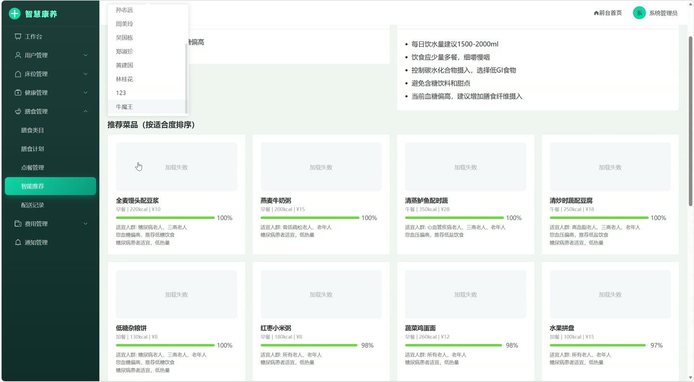
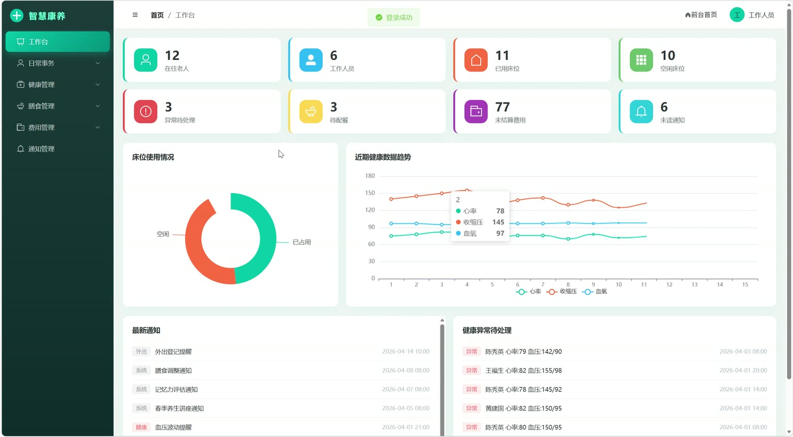
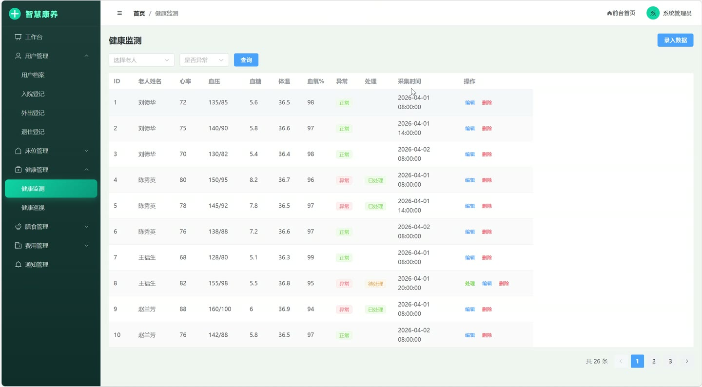
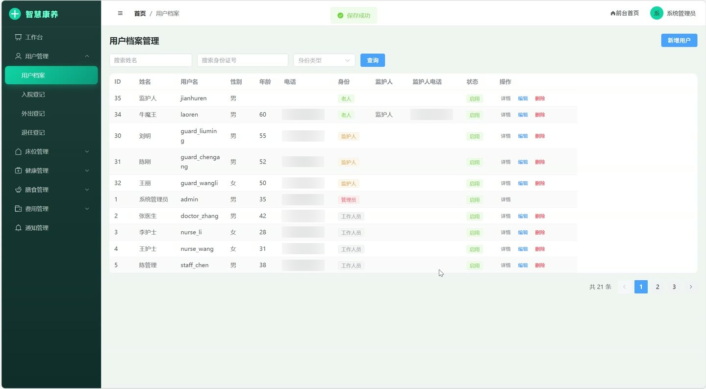
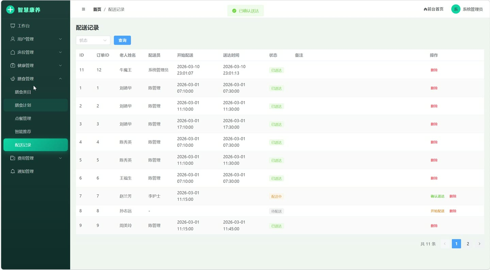

# (附文档)Springboot2+Vue3+MySQL 智慧康养服务平台

**技术栈**：Springboot2、Vue3、MySQL

### 系统简介

智慧康养服务平台是一套面向养老机构的数字化管理系统，采用前后端分离架构，涵盖老人入住管理、健康监护、膳食管理、费用结算、亲情联动等核心业务场景。系统内置普通用户端（老人/监护人）、管理员端、医护端三类角色，通过统一权限控制实现多端协同管理，帮助养老机构实现服务流程标准化、健康数据可视化、费用结算自动化。
 
### 核心功能
 
### 普通用户端

- 登录认证：支持用户名密码登录，密码采用MD5加密存储，登录状态缓存至Redis（30分钟有效），支持退出登录

- 个人信息查看：登录后可查看个人基本信息，包含姓名、身份证号、慢性病史、过敏史等健康档案字段

- 健康数据上报：录入心率、收缩压/舒张压、血糖、体温、血氧等体征数据，系统自动进行异常检测（心率>100或140、血糖>7.0、体温>37.3、血氧 
### 管理员端

- 仪表盘统计：展示老人总数、员工总数、总床位数、入住率、待处理异常健康数据、待处理点餐订单、未缴费记录、未读通知等核心运营指标

- 用户管理：查看用户列表（支持按身份类型筛选），新增/编辑/删除用户，停用/启用账号（停用后无法登录）

- 房间管理：维护房间信息，包含房间号、房间价格等字段，支持新增/编辑/删除

- 床位管理：维护床位信息（床位编号、所属房间），支持按房间和状态筛选，查看空闲床位列表，新增/编辑/删除床位

- 入院审批：查看入院申请列表（按状态筛选），审批通过后自动占用床位（床位状态置为占用并绑定入住老人）并发送通知给老人

- 出院结算：查看出院申请列表，执行结算操作（状态置为已结算），出院时自动释放床位

- 床位调换审批：查看调换申请列表，审批通过后自动释放原床位并占用新床位，记录审批人和审批时间；支持驳回操作

- 健康数据管理：查看所有老人健康数据（按用户和异常状态筛选），对异常数据进行处理标记（置为已处理），查看最近20条健康记录

- 健康巡视管理：新增/编辑/删除巡视记录，记录巡视时间、巡视结果等信息

- 膳食分类管理：维护菜品分类（菜品名称、餐类型、价格、热量、营养信息、适宜人群、禁忌信息），支持按名称和餐类型筛选，上下架菜品

- 膳食计划管理：为老人制定膳食计划，按用户查看计划列表，新增/编辑/删除计划

- 点餐订单管理：查看所有订单（按用户和状态筛选），更新订单状态（待处理→配送中→已送达），送达时自动记录送达时间

- 配送记录管理：查看配送记录列表，指派配送员开始配送（记录配送员和开始时间），确认到达（记录到达时间）

- 费用记录管理：查看费用记录（按用户/费用类型/状态筛选），手动新增费用，执行结算操作，删除费用记录

- 费用自动结算：一键生成为所有在住老人生成月度床位费和护理费（按护理等级1/2/3级分别收取500/1500/3000元），自动汇总老人已送达餐饮订单生成餐饮费

- 充值管理：查看老人充值记录，为老人办理充值（记录充值金额和余额）

- 通知管理：查看系统通知列表，手动发送通知给指定用户，删除通知

- 文件上传：支持上传图片等文件，返回可访问的文件URL路径
 
### 医护端

- 健康数据录入：为老人录入体征数据，系统自动进行异常检测并标记

- 健康预警推送：当录入数据触发异常阈值时，通过RabbitMQ异步推送健康预警消息

- 巡视记录管理：新增巡视记录，记录巡视时间、巡视结果，按老人查看历史巡视记录

- 异常数据处理：查看待处理异常健康数据列表，对异常数据进行处理并标记为已处理
 
### 技术栈

后端框架Spring Boot 2.x
ORM框架MyBatis-Plus（含分页插件、字段自动填充）
权限方案Session认证 + Redis缓存登录状态
前端框架Vue 3
状态管理Vue Router（前端路由转发）
消息队列RabbitMQ（健康预警、费用通知异步推送）
数据库MySQL
缓存中间件Redis（登录缓存、健康数据缓存）
构建工具Maven
 
### 交付内容

- 后端完整源码

- 前端完整源码

- 数据库初始化脚本

- 万字文档

## 界面展示

---

## 获取完整源码 + 万字文档

本仓库为项目介绍页。**完整前后端源码、数据库初始化脚本、万字项目文档**，请加微信 `kangkangcode`，或访问 [codekk.top](http://codekk.top) 获取。

可作课程设计 / 毕业设计参考，支持远程部署调试。